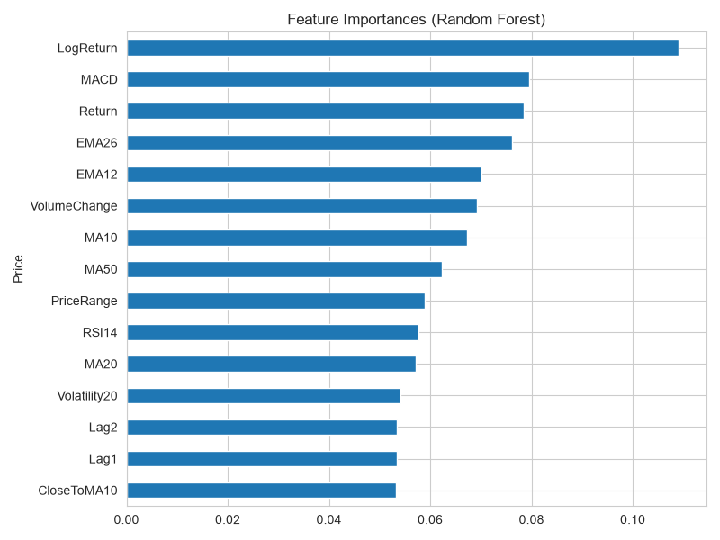
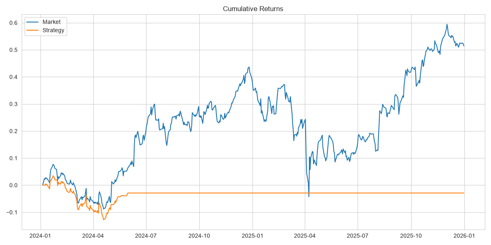

# ML-Based Stock Trend Prediction and Backtesting

## Overview

This project builds an end-to-end machine learning pipeline to predict the next-day price movement of Apple (AAPL) stock using technical indicators derived from historical market data.

The workflow includes automated data collection, preprocessing, feature engineering, model training and comparison, hyperparameter tuning, and backtesting of a rule-based trading strategy. The project is intended as an educational demonstration of applying machine learning techniques to financial time-series data.

---

## Project Motivation

Financial markets generate large amounts of historical data that can be analyzed using machine learning techniques. This project explores whether technical indicators and historical price information can be used to predict short-term market trends.

The primary objective is not to outperform the market, but to demonstrate an end-to-end machine learning workflow involving data preprocessing, feature engineering, model evaluation, and trading strategy backtesting.

---

## Features

- Automated download of historical stock data using Yahoo Finance
- Data cleaning and preprocessing
- Exploratory Data Analysis (EDA)
- Technical indicator generation
- Feature engineering for time-series prediction
- Multiple machine learning model comparison
- Hyperparameter tuning using GridSearchCV
- Feature importance analysis
- Rule-based trading signal generation
- Strategy backtesting with transaction costs
- Performance visualization

---

## Workflow

1. Download approximately 10 years of daily AAPL stock data.
2. Perform exploratory data analysis and data cleaning.
3. Generate technical indicators including:
   - Daily Returns
   - Moving Averages (MA)
   - Exponential Moving Averages (EMA)
   - MACD
   - RSI
   - Historical Volatility
   - Volume Change
   - Lag Features
4. Create prediction labels for next-day price movement.
5. Split the dataset using a time-aware train/test split.
6. Train and evaluate:
   - Logistic Regression
   - Decision Tree
   - Random Forest
   - Support Vector Machine (SVM)
7. Tune the Random Forest model using GridSearchCV.
8. Generate trading signals from model predictions.
9. Backtest the trading strategy using next-day execution with transaction costs.
10. Compare model performance and visualize results.

---

## Technologies

### Programming Language
- Python

### Libraries
- NumPy
- Pandas
- Matplotlib
- Seaborn
- Scikit-learn
- yfinance

### Tools
- Jupyter Notebook
- Git
- GitHub

---

## Dataset

The project uses approximately ten years of daily historical price data for Apple Inc. (AAPL), downloaded directly from Yahoo Finance using the `yfinance` Python library.

The dataset contains:

- Open
- High
- Low
- Close
- Adjusted Close
- Volume

No external datasets are required.

---

## Results

The project compares the predictive performance of multiple machine learning models for next-day stock movement prediction.

The trained models are converted into trading signals and evaluated using a simple long-only backtesting framework with transaction costs.

Generated outputs include:

- Model accuracy comparison
- Classification metrics
- Feature importance analysis
- Confusion matrices
- Equity curve
- Strategy cumulative returns

> **Note:** Financial markets are inherently noisy and unpredictable. The project is intended for educational purposes and should not be considered financial advice.

---

## Screenshots

### Model Comparison


### Feature Importance



### Strategy Performance



---

## Project Structure

```text
.
├── src/
│   ├── utils.py
│   ├── indicators.py
│   └── backtest.py
├── scripts/
├── images/
├── data/
├── Quant_Trading_expanded.ipynb
├── README.md
├── requirements.txt
├── LICENSE
└── .gitignore
```

---

## Installation

Clone the repository:

```bash
git clone https://github.com/krmangalam16/ML-based-Stock-Trend-Prediction-and-Backtesting.git
```

Navigate to the project directory:

```bash
cd ML-based-Stock-Trend-Prediction-and-Backtesting
```

Create a virtual environment (optional):

```bash
python -m venv .venv
```

Activate the environment:

**Windows**

```bash
.venv\Scripts\activate
```

**Linux / macOS**

```bash
source .venv/bin/activate
```

Install dependencies:

```bash
pip install -r requirements.txt
```

---

## Usage

Launch Jupyter Notebook:

```bash
jupyter notebook Quant_Trading_expanded.ipynb
```

Run the notebook from top to bottom to:

- Download historical data
- Generate features
- Train machine learning models
- Evaluate performance
- Backtest the trading strategy
- Visualize the results

---

## Future Work

- Evaluate additional technical indicators
- Extend the framework to multiple stocks
- Experiment with gradient boosting models (XGBoost, LightGBM)
- Perform walk-forward validation
- Improve portfolio management and risk metrics
- Explore deep learning models such as LSTMs and Transformers

---

## License

This project is licensed under the MIT License. See the **LICENSE** file for details.
