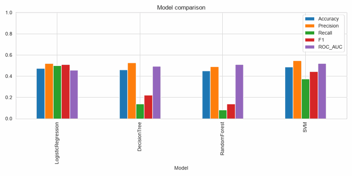

 

# ML-Based Stock Trend Prediction and Backtesting

A machine learning project that predicts the next-day direction of Apple (AAPL) stock using technical indicators and evaluates a rule-based trading strategy through historical backtesting.

The project includes:
- Data collection using Yahoo Finance
- Feature engineering with technical indicators
- Comparison of multiple ML classifiers
- Hyperparameter tuning using GridSearchCV
- Strategy backtesting with transaction costs

Presentation:

How to run (one-liner)

Run the notebook with:

    jupyter notebook Quant_Trading_expanded.ipynb

Project Motivation

Predicting stock prices is hard. This project demonstrates how to:
- Download and clean historical stock data
- Create technical indicators and basic features
- Train and compare simple ML models (Logistic Regression, Decision Tree, Random Forest, SVM)
- Tune Random Forest with GridSearchCV
- Build a straightforward trading strategy from model predictions and backtest its performance

This is an educational project and does not constitute financial advice.

Workflow

1. Download 10 years of daily data for AAPL using yfinance
2. Exploratory data analysis (plots and summary statistics)
3. Feature engineering (returns, moving averages, RSI, volatility, etc.)
4. Build target and prepare dataset
5. Train and compare models
6. Tune Random Forest with GridSearchCV
7. Create trading signals from predictions and backtest
8. Summarize results and limitations

Technologies Used

- Python 3.8+
- pandas, numpy
- matplotlib, seaborn
- scikit-learn
- yfinance

Dataset

Daily stock prices for AAPL downloaded via yfinance.

Installation

1. Create a virtual environment (recommended):

   python -m venv .venv
   .\\.venv\\Scripts\\activate

2. Install dependencies:

   pip install -r requirements.txt

Usage

Open and run the Jupyter notebook:

   jupyter notebook Quant_Trading_expanded.ipynb

Project Structure

Stock-Trend-Prediction/

- Quant_Trading_expanded.ipynb # Main notebook (analysis, modeling, backtest)
- README.md
- requirements.txt
- .gitignore
- LICENSE
- src/
    - utils.py                # Data download / cleaning / prepare helpers
    - indicators.py           # Technical indicator functions
    - backtest.py             # Simple backtesting utilities
- scripts/                    # small reproducible scripts
- images/                     # Plots and screenshots
- data/                       # Data folder (downloaded CSVs if saved)

Results

Expect modest predictive performance (often around 50–65% accuracy). See results.txt for a concise numeric summary and the images/ folder (model_comparison.png, feature_importances.png, cumulative_returns.png) for the plotted outputs — useful when demoing the project.

Future Improvements

- Try more features (momentum, more timeframes)
- Use more advanced models (XGBoost, LightGBM) — learn after mastering basics
- Implement transaction costs, slippage, and position sizing for realistic backtesting
- Walk-forward cross-validation for time-series-aware model validation

Screenshots

(Placeholders in images/)

License

This project is licensed under the MIT License - see LICENSE for details.

